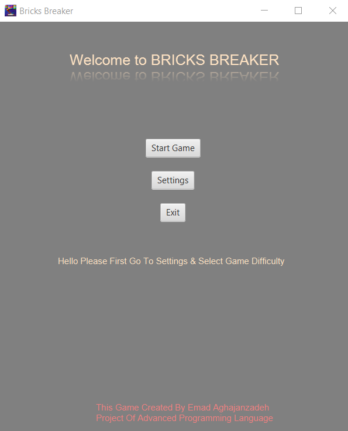
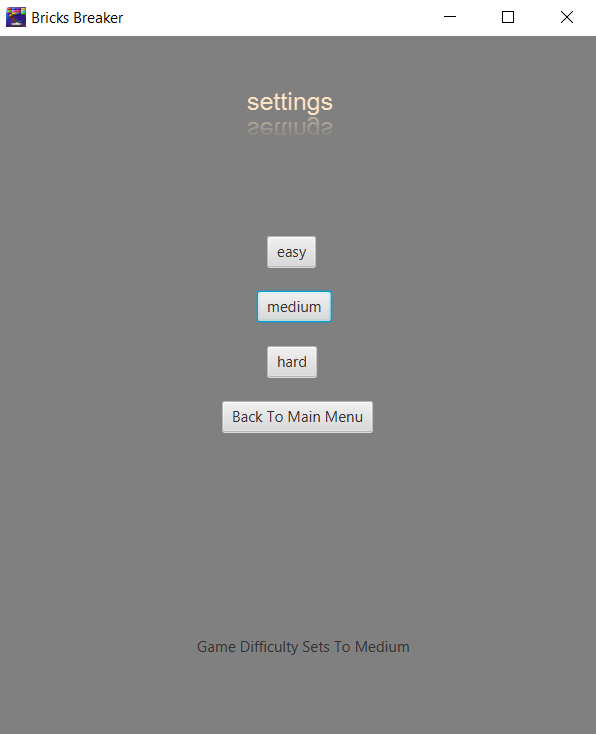
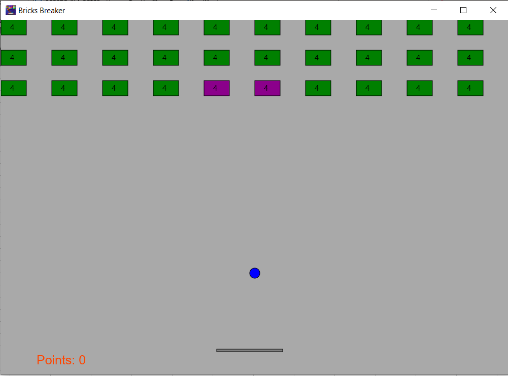
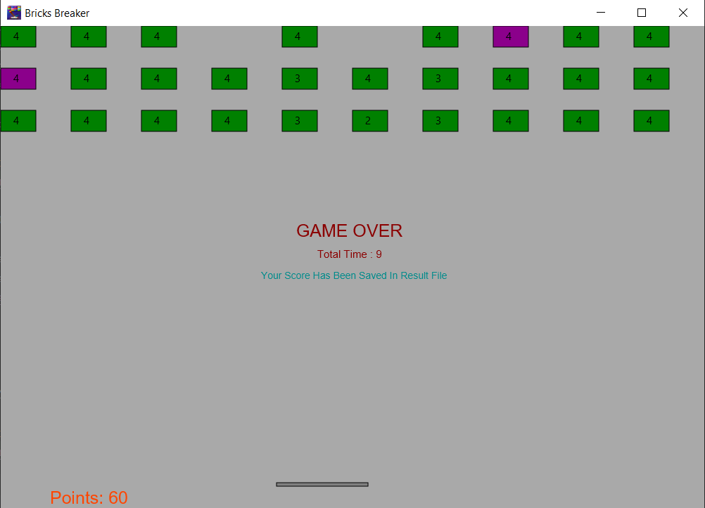

# Bricks Breaker Game

## Description
This project was given during the course of advanced programming, and its aim was to implement a game, like breaks breaker to make the students understand better the concepts of **object-oriented programming**.
My implementation consists of the following classes for which I wrote simple explanations below.

## Implementation

###### Racket
This class is responsible for showing the rocket, and preserving its location, and movements.

###### Ball
This is the most fundamental class of the program since it controls the ball's movements and all other actions related to them, e.g., scoring and losing.
To be more concrete, the function **circle motion** manages the movements of the ball and checks for special events' occurrence. In other words, iteratively, checks the possible collisions between the ball and bricks as well as the ground (in case of losing). Moreover, some bricks have gifts inside, including, increasing the reward score to 20, halving the ball's speed and increasing its reward to 15, and doubling the rocket's width. The determination of which bricks contain which gift was done by random numbers generation.

###### Gift
The gift class is for managing the aforementioned gifts which are donated based on the ball movement.

###### Brick
This class can produce a brick and show them in the game. It contains each brick's attributes such as whether it is an especial one or not.

## Visualization
Here you can see some images of the game.

First you will see the game menu.

Then you need to select the difficulty level you like.

following this, after pushing the button "Start Game" the game window appears.

Finally, once you lost the game, this message will be shows to you and your performance would be stored in a .txt file named as result.

